AI Usage Disclosure:

I declare that I have not used any AI for writing the assignment report itself
I declare that I have used grammerly to fix grammer and sentence structures in this report.

# Big Data Platforms - Assignment 3

**Student:** Muhammad Sabeeh Waqas
**ID:** 103704559

---

## Overview

This assignment extends the mysimbdp platform from Asg 2 with stream analytics. The same infrastructure (Kafka, Cassandra, Docker) is reused. A PySpark streaming job is added that takes raw sensor readings in real time, computes sliding windows, aggregates per country, detects PM2.5/PM10 threshold breaches, writes analytics results to Cassandra, and sends alerts back to the tenant via a dedicated Kafka topic.

**Tech stack:** Apache Kafka (messaging), PySpark Structured Streaming (stream processing), Cassandra (mysimbdp-coredms), Python, Docker Compose.

**Architecture diagram:**
(Diagram created using draw.io)

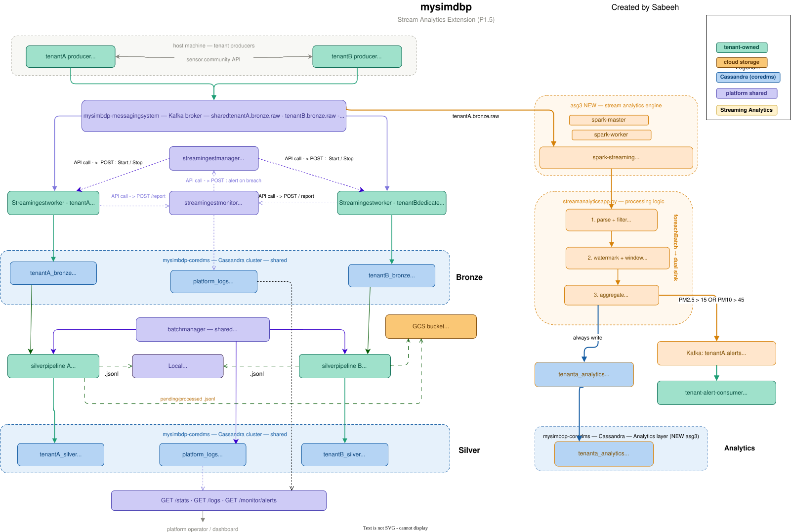

_Note: As mentioned,I have done this asg as an addition to Asg 2, so i have created a new streaming analytics feature on top of the same Asg2 architecture, so some of the code,architecture diagram components and features might not be relevant for this assignment.
Why? for my ease, otherwise I would had to build everything from scratch again._

---

## Part 1 - Design for Streaming Analytics

### P1.1 - Dataset and Scenario

**Dataset:** sensor.community open air quality API ('https://github.com/opendata-stuttgart/meta/wiki/EN-APIs'). This API gives a live snapshot of readings from around 15,000 air quality sensors all over the world owned by people. Each reading has a sensor ID, location (lat/lon/country), and air quality measurements like PM2.5 (fine particles, field P2) and PM10 (coarser particles, field P1) from sensors like the SDS011.

**Why this dataset works for streaming:** The data updates every few minutes from thousands of sensors globally so it is continuous and high volume. Air quality is a growing public health concern. In my Asg 2 solution, air quality data was stored in Cassandra as a batch process every 5 minutes. But pollutants sometimes need to be caught ASAP, especially in sensitive places like hospitals, schools, or areas near natural disasters like volcanoes or hurricanes. Waiting 5 minutes to find out the air can be dangerous and too slow. A streaming solution that gives an alert within seconds can be much more useful.

**Scenario:** TenantA is a public health monitoring service. They push raw sensor readings into the platform in near real time. The `streamanalyticsapp` computes rolling average PM2.5 and PM10 per country over sliding 1 minute windows. When the average PM2.5 in a country goes above 15 μg/m^3 (WHO 24h guideline) or PM10 goes above 45 μg/m^3, an alert is sent to the tenant.

**What streamanalyticsapp does:**

- Reads from Kafka topic `tenantA.bronze.raw` (same old topic)
- Groups records by country and 1 minute sliding window and slides every 30 seconds (streaming analytics)
- Computes avg PM2.5, avg PM10, max PM2.5, max PM10, and record count per window (streaming analytics)
- Marks windows where either threshold is crossed (`alert_fired = True`)
- Writes all window results to Cassandra keyspace `tenanta_analytics`, table `window_results`
- Simultaneaouly, Sends alert JSON to Kafka topic `tenantA.alerts` only when `alert_fired = True`

**Data sink in mysimbdp-coredms (Cassandra):**

```sql
tenanta_analytics.window_results
  country        text       -- partition key
  window_start   timestamp  -- clustering key (DESC)
  window_end     timestamp
  avg_pm25       double
  avg_pm10       double
  max_pm25       double
  max_pm10       double
  record_count   bigint
  alert_fired    boolean
```

`country` is the partition key so all windows for the same country sit on the same Cassandra node, which makes per-country queries fast.

---

### P1.2 - Keyed vs Non-Keyed Streams and Message Delivery Guarantees

**Keyed stream:** The stream is keyed by `country`.

- In the Kafka producer, messages are split by `sensor_id` so all readings from the same sensor always go to the same Kafka partition, keeping per sensor ordering intact.
- In PySpark, the windowed aggregation groups by `(window, country)`, so the stream is effectively keyed on country for the analytics.

Why key by country and not by sensor?

- The goal is per-country air quality averages, not per-sensor readings (my own choice)
- Many sensors exist per country, so grouping by country spreads the work evenly across Spark tasks
- Cassandra is also partitioned by country, so writes works efficiently

Example: a reading from sensor `78901` in Finland (`country=FI`) goes to partition `hash(78901) % 6` in Kafka, and contributes to the `FI` group in the Spark window aggregation.

**Message delivery guarantees:** At-least-once delivery is the right choice here.
Why? :

- The producer uses `enable.idempotence=True` and `acks=all` this means the producer itself will not create duplicates within a single session, so its good.
- On the Spark side, `foreachBatch` with checkpointing means if a batch fails and retries, some windows get recomputed and rewritten to Cassandra but since the primary key is `(country, window_start)`, rewriting the same window just overwrites the same row with the same data, so no harm is done.

Exactly-once end-to-end would need Kafka transactions and coordination with Cassandra, which is much more complex to build and maintain. For a public health alert system,<u> a duplicate alert is far less dangerous than a missed one, so at-least-once is the right tradeoff.</u>

---

### P1.3 - Time, Windows, Watermarks, and Out-of-Order Data

**Event time vs processing time:** Event time is used and is taken from the `timestamp` field in each sensor reading, which is the time the sensor actually took the measurement. This is the correct choice because:

- We want to know what the air quality was at a specific moment in time, not when the data happened to arrive in our system
- Sensor readings can be delayed by network issues.
- If we used processing time instead, readings from the same measurement period could end up in different windows just because they arrived at slightly different times, so it not good for our analytics.

If a record has no timestamp, the other option can be `kafka_ts` it is the timestamp the Kafka broker assigns when the message arrives.

**Window type and parameters:**

**Sliding window - 1 minute duration, sliding every 30 seconds**

- Each sensor reading contributes to 2 overlapping windows at the same time
- A 1 minute window catches pollution spikes quickly, a dangerous PM2.5 reading shows up in results within 1 minute of occurring, rather than being spread and damped across a 5 minute average
- Sliding every 30 seconds means a new window result is produced every 30 seconds, which matches the Spark trigger interval - so Spark wakes up, processes data, and emits results at the same frequency the window moves, so its all aligned.

**Tradeoff:** Because the window is only 1 minute wide, each window captures fewer sensor readings than a wider window would. This means the averages are a bit noisier and sensitive to a single bad reading. A wider window (like 5 minutes) would give smoother, more reliable averages, but we have to wait longer before an alert is fired.

Window function used:

```python
groupBy(window(event_time, "1 minute", "30 seconds"), country)
```

with `avg , max , count` as aggregation functions.

**Alternative tested:** 5 minute sliding window (`WINDOW_DURATION=5 minutes , WINDOW_SLIDE=1 minute`), this produces fewer rows in Cassandra, each has a higher `record_count` obviously, smoother average, but alert latency goes up.

**What causes out-of-order data:**

- The sensor.community API updates every 5 minutes but gets polled every 0.5 seconds. Readings from the same measurement window can move across many polls
- Network delay varies from sensor to sensor, so some arrive fast, some slow
- If the Spark job restarts, it replays from the last checkpoint, which can bring in records that are slightly out of order relative to what was already processed

**Watermark:** A 2 minute watermark is applied using `withWatermark("event_time", "2 minutes")`. This tells Spark to wait up to 2 minutes for late arriving records before closing a window and writing the result.

Why 2 minutes?:

- It covers typical API polling delays which are under 1 minute
- Keeping it small avoids holding too much window state in memory (a bigger watermark means more memory used)
- It keeps alert latency reasonable

**Important note on actual alert latency:** Because of the watermark, Spark will not emit the final result for a window until `window_end + 2 minutes`. So the real worst case alert latency is about <u>2.5 minutes</u> i.e. 1 minute for the window to fill, 2 minutes of watermark delay, plus one 30 second trigger cycle. Not 30 seconds.

Note: Watermarks are necessary because without one, Spark keeps every window open forever in memory in case a late record arrives, and the job eventually runs out of memory.

---

### P1.4 - Key Performance Metrics

**1. End-to-end latency (event to alert)**

- **What it is:** The time from when the sensor takes a measurement to when the alert appears in `tenantA.alerts`
- **How to measure:** Compare the `timestamp` field in the raw Kafka message with the `alert_ts` field in the alert JSON. This can be logged directly inside the `write_batch()` function
- **Expected range:** Best case around 30 seconds (one trigger cycle after the window closes). Worst case around 2.5 minutes (1 minute window + 2 minute watermark + one 30 second trigger)
- **Why it matters:** For our scenario speed is the most important. The 2 minute watermark is the biggest factor, lowering it speeds alerts up but risks dropping late records (its a tradeoff and a design choice). This metric is relevant to the tenant (checking their SLA is met in regards to Asg 2) and the platform operator (for scalling)

**2. Micro batch processing time**

- **What it is:** How long Spark takes to process one batch from start to finish, from when the trigger fires to when the Cassandra write completes
- **How to measure:** The Spark Streaming UI at `http://localhost:8080` shows this per batch. Also visible in the `spark-streaming` container logs.
- **Why it matters:** If one batch takes longer than 30 seconds to process (the trigger interval), the next batch starts queuing up behind it. If this keeps happening, the lag grows without limit and alerts become very delayed. Relevant to the platform operator for scaling.

**3. Throughput (records per second)**

- **What it is:** How many sensor readings the streaming job processes per second
- **How to measure:** Sum `record_count` across all windows in a batch and divide by `TRIGGER_INTERVAL`. Also measurable by checking Kafka consumer group lag with `kafka-consumer-groups.sh --describe`
- **Why it matters:** The platform needs to keep up with all 15,000 sensors reporting at once. If throughput is too low, the Kafka lag keeps growing.

**4. Cassandra write success rate**

- **What it is:** The percentage of batches where the Cassandra write completes without error
- **How to measure:** Count `✅ Cassandra write ok vs ❌ Cassandra write failed` log lines in the `spark-streaming` container logs
- **Why it matters:** A failed write means that windows analytics results are lost permanently. Relevant to the platform operator (reliability) and the tenant ( to make sure there is complete data)

**5. Alert precision (false positive rate)**

- **What it is:** What percentage of fired alerts represent a real pollution event versus a bad reading (like a broken sensor sending -999.0 for PM2.5)
- **How to measure:** Look at `alert_fired=True` rows in Cassandra, check the `avg_pm25` value and the `record_count`. A window with `record_count < 3` is statistically unreliable and its alert is probably a false positive
- **Why it matters:** If the tenant gets too many false alerts, they stop trusting the system. Its a quality check metric.

---

### P1.5 - Architecture Design

Old reused Architeture (Asg 2)
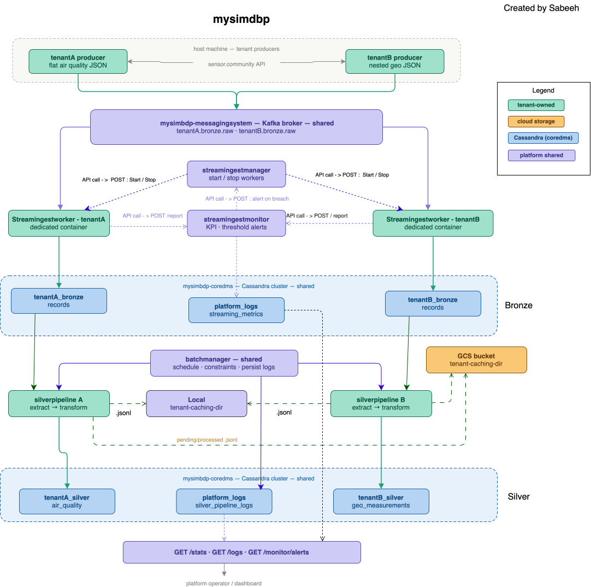

New Architecure Asg 3, the Spark streaming job, the alert Kafka topic, the analytics Cassandra layer, and the tenant alert consumer
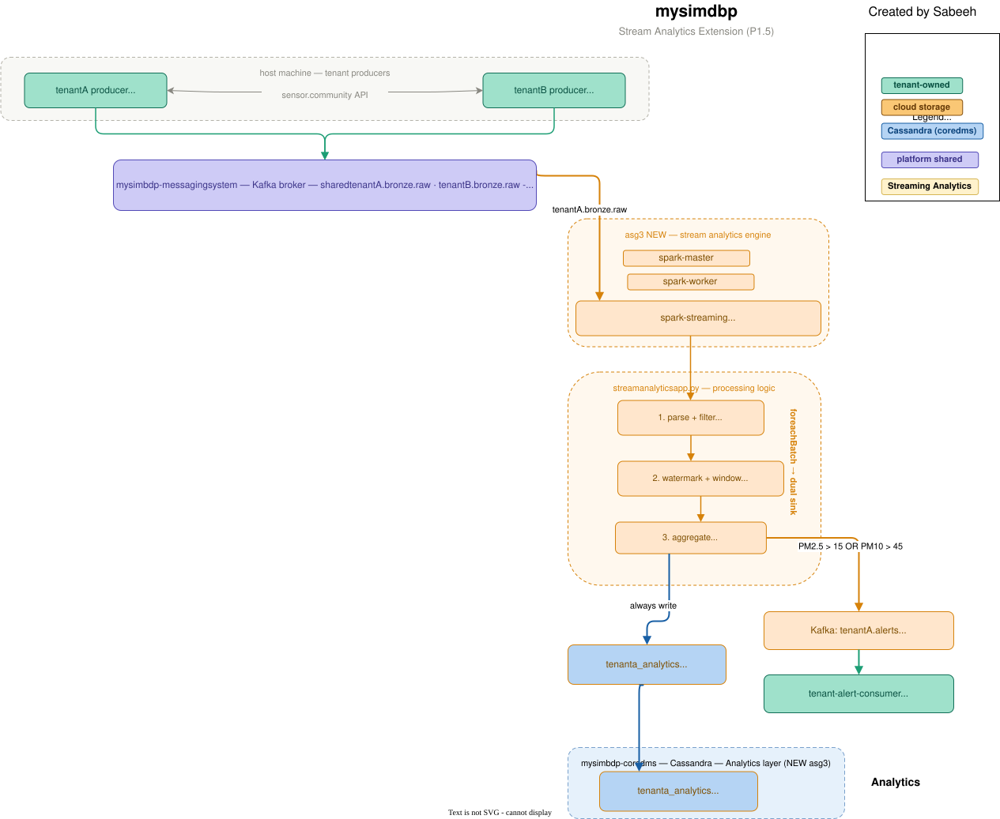

The diagram below shows the full system. The left side is reused from Asg 2 (Kafka broker, ingestion workers, silver pipeline, Cassandra bronze and silver layers). The right side is new for Asg 3, the Spark streaming job, the alert Kafka topic, the analytics Cassandra layer, and the tenant alert consumer.


**Technology choices:**

- **Kafka** (reused from Asg 2): Already running, nothing extra to set up. The existing `tenantA.bronze.raw` topic feeds straight into the streaming job with no changes to the producer
- **PySpark Structured Streaming**: Chosen over Flink because PySpark has a cleaner Python API and I have some handone in Apache Spark.
- **Cassandra** (reused from Asg 2): Already running. A new `tenanta_analytics` keyspace was added alongside the existing bronze and silver keyspaces. Partitioning by `country` makes per-country queries fast
- **local[2] Spark mode**: Spark runs with 2 threads inside a single Docker container. For the scale of this assignment (a few thousand records per minute) this is enoughfor now. In production platform manager can switch to a proper Spark cluster with `--master spark://spark-master:7077`

**What is reused from Asg 2:** Kafka broker, Cassandra cluster, Docker network, `tenantA_producer.py` (with environment variable patches for speed control), `bootstrap.sh` (extended to create the new alert topic and analytics schema), and `docker-compose.yaml` (extended with 4 new services). The `streamingestworker` from Asg 2 keeps running and writing raw data to `tenanta_bronze.records` in parallel - the Asg 3 streaming job reads from the same Kafka topic but uses a completely separate consumer group, so neither job interferes with the other.

---

## Part 2 - Implementation of Streaming Analytics

### P2.1 - Schemas, Serialization, and Processing Logic

**Input schema** (matches `tenantA_producer.py` flat JSON exactly (same as Asg 2):

```python
INPUT_SCHEMA = StructType([
    StructField("tenant_id",     StringType(),  True),
    StructField("event_id",      LongType(),    True),
    StructField("timestamp",     StringType(),  True),  # event time
    StructField("sensor_id",     LongType(),    True),
    StructField("lat",           DoubleType(),  True),
    StructField("lon",           DoubleType(),  True),
    StructField("alt",           DoubleType(),  True),
    StructField("country",       StringType(),  True),
    StructField("sensor_type",   StringType(),  True),
    StructField("pm10_P1",       DoubleType(),  True),
    StructField("pm2_5_P2",      DoubleType(),  True),
    StructField("ingest_ts_utc", StringType(),  True),
])
```

**Analytics output schema** (written to Cassandra):

```
country text, window_start timestamp, window_end timestamp,
avg_pm25 double, avg_pm10 double, max_pm25 double, max_pm10 double,
record_count bigint, alert_fired boolean
```

**Why enforce schemas:** Without a fixed schema, PySpark's `from_json` would guess the field data types when running. A single bad record could make `pm2_5_P2` from a number to a string, which can break everything later in pipeline. Defining the schema also acts as a contract between the tenant and the platform, both sides know exactly what to send and what to expect, which makes the system much easier if something goes wrong.

**Serialization and deserialization:** Records arrive from Kafka as raw bytes. The job reads them with `from_json(col("value").cast("string"), INPUT_SCHEMA)`, bytes to string to structured columns. Alert messages going back out to Kafka are serialized with `to_json(struct(...))`. Cassandra writes go through the Spark-Cassandra connector which handles the type mapping automatically.

**Processing steps:**

1. Read raw bytes from Kafka using `readStream`
2. Cast the `value` column from bytes to string and parse it with `from_json` using `INPUT_SCHEMA`
3. Drop any records where `country` is null or `timestamp` is null
4. Convert the `timestamp` string to a proper timestamp type with `to_timestamp( , "yyyy-MM-dd HH:mm:ss")`
5. Apply a 2 minute watermark on `event_time`
6. Group by `(window(event_time, "1 minute", "30 seconds"), country)`
7. Aggregate: `avg(pm2_5_P2)`, `avg(pm10_P1)`, `max(pm2_5_P2)`, `max(pm10_P1)`, `count(*)`
8. Add `alert_fired` boolean: `True` when `avg_pm25 > 15.0` OR `avg_pm10 > 45.0`
9. Write via `writeStream` with `outputMode("update")` and `foreachBatch(write_batch)`

**How results get back to the tenant in near real time:** Inside `write_batch()`, after writing everything to Cassandra, the code filters for rows where `alert_fired = True` and publishes those as JSON messages to `tenantA.alerts`. The tenant's `alert_consumer.py` uses this topic and gets the alert within one trigger cycle i.e. 30 seconds at most from when the window was last updated. The trigger interval can be managed via the `TRIGGER_INTERVAL` environment variable in docker-compose.

---

### P2.2 - Test Environment

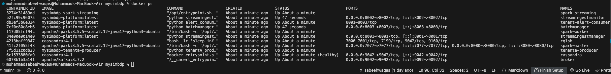

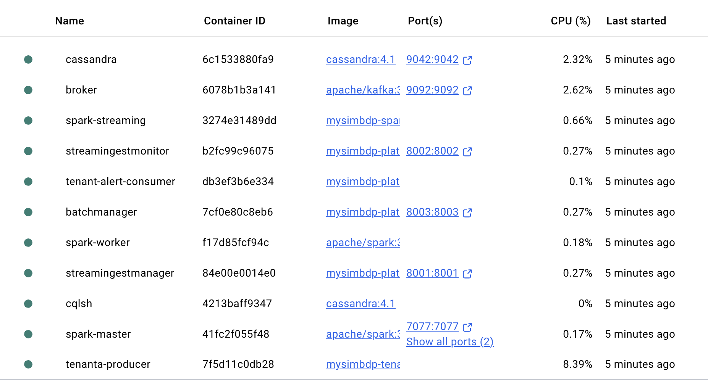

The whole test environment runs in Docker on my local computer. All services talk to each other over a single Docker bridge network like Asg 2.

**What is running:**

- `broker`: Apache Kafka 3.7.2 in KRaft mode (no Zookeeper needed), 6 partitions per topic
- `cassandra`: Cassandra 4.1, single node, replication factor 1
- `tenanta-producer`: Python 3.12, polls the sensor.community API every 0.5 seconds (2 messages/second baseline)
- `spark-streaming`: apache/spark:3.5.5, local[2] mode, triggers every 30 seconds
- `tenant-alert-consumer`: Python 3.12, reads from `tenantA.alerts` and prints alerts

Note: Some other services like cqlsh, for cqlsh server, streaming manager, batchmanager,streamingmonitor these are Asg2 services.

**How streaming data is produced:** `tenantA_producer.py` fetches one real sensor reading from the sensor.community API every 0.5 seconds and puts it into Kafka. For speed tests,

Note: `streaming/speed_test.py` can be used to generates fake records locally at controlled rates (1 msg/s, 10 msg/s, 100 msg/s, or flood) without hitting the external API. This makes load testing repeatable and predictable.

**Key configuration values:**

We can change these are per liking , so far selected value are my personal design choices.

- `WINDOW_DURATION=1 minute`, `WINDOW_SLIDE=30 seconds`, `WATERMARK_DELAY=2 minutes`
- `PM25_ALERT_THRESHOLD=15.0` μg/m^3, `PM10_ALERT_THRESHOLD=45.0` μg/m^3
- `SPARK_SHUFFLE_PARTITIONS=4`, `--master local[2]`
- Kafka consumer group: `streamanalyticsapp-tenantA`
- Checkpoint location: Docker volume `spark_checkpoint` at `/tmp/spark-checkpoint/streamanalyticsapp`

---

### P2.3 - Running the App and Performance Observations

docker logs spark-streaming showing batches processing and alerts:

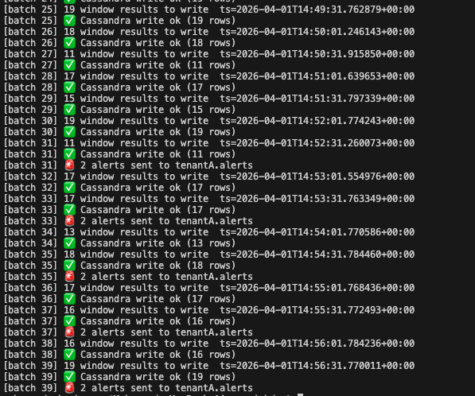]

Cassandra table showing window_results rows data with alerts fired

 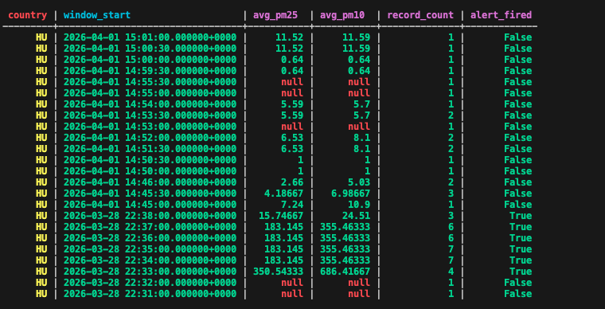

docker logs tenant-alert-consumer showing alerts

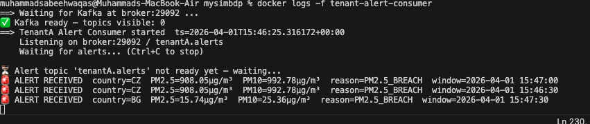

**(i) Effect of varying streaming data speed:**

speed_test.py --speed slow running + Cassandra query showing low record_count

stream:
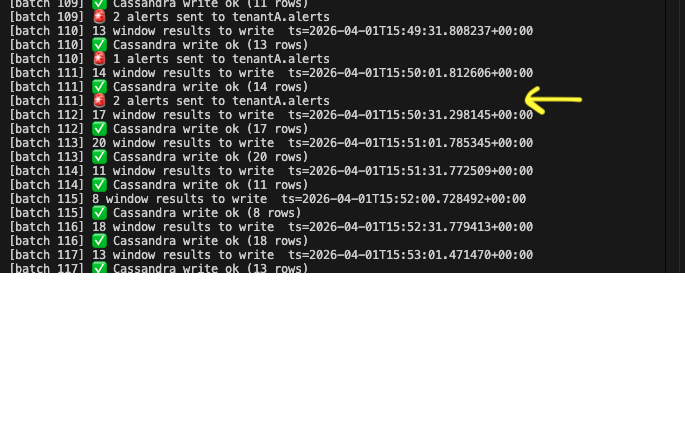

cassandra:
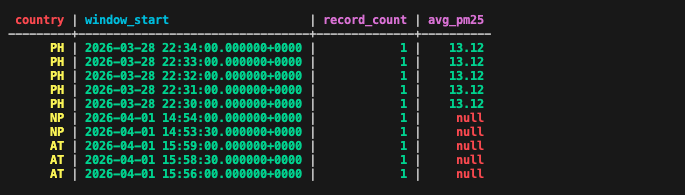

speed_test.py --speed fast running + Cassandra query showing high record_count

Stream:
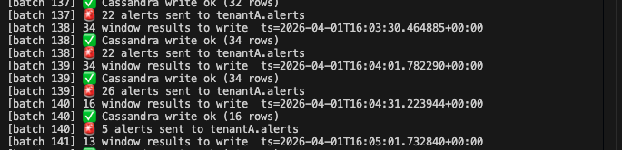

Cassandra:
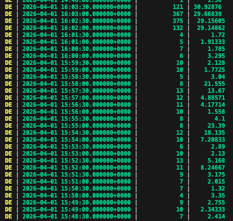

At slow speed (1 msg/s), each 1 minute window builds up roughly 5 records. Spark finishes each batch well within the 30 second trigger interval. Cassandra writes are fast and there is no Kafka lag.

At fast speed (100 msg/s), each window accumulates around 30 records. Batch processing time goes up but still stays within the 30 second trigger window with local[2]. Averages are much more stable statistically because there are many more readings per window, and more countries appear in each batch.

At flood speed (as fast as possible), Kafka consumer lag starts building up after about 30 seconds, Spark cannot process records as fast as they arrive. This is expected with only 2 local threads. Switching to local[4] reduces the lag noticeably.

**(ii) Effect of changing window parameters:**

By default the window size is 1 min

**Narrow window (1 min / 30s slide) - default:**
Cassandra result with WINDOW_DURATION=1 minute: showing more rows, lower record_count

 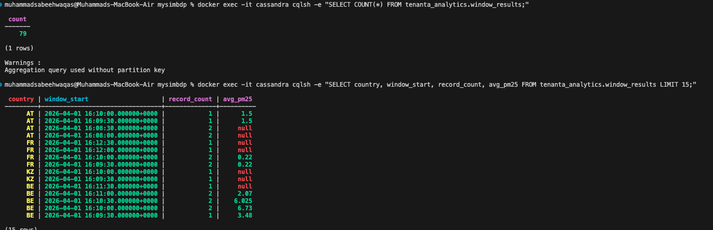

More rows in Cassandra, each with lower `record_count`. Averages are noisier because fewer readings go into each window. A single bad sensor reading has a bigger effect on the average. Alerts fire faster.

**Wide window (5 min / 1 min slide) - alternative:**
Cassandra result with WINDOW_DURATION=5 minutes, showing fewer rows, higher record_count

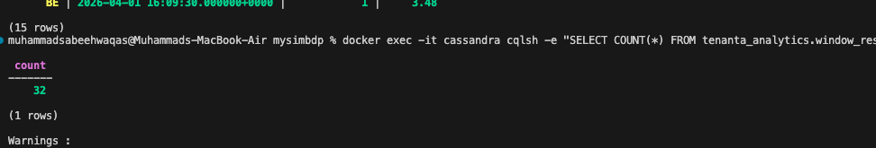
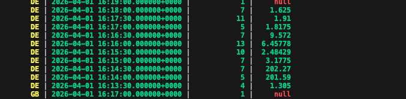

Fewer rows, much higher `record_count` per window, smoother and more reliable averages. Better for catching sustained pollution events rather than spikes. Alert latency increases by around 4-5 extra minutes on top of the watermark delay.

---

### P2.4 - Erroneous Data Handling

inject_errors.py running in terminal showing all 7 error types being sent

 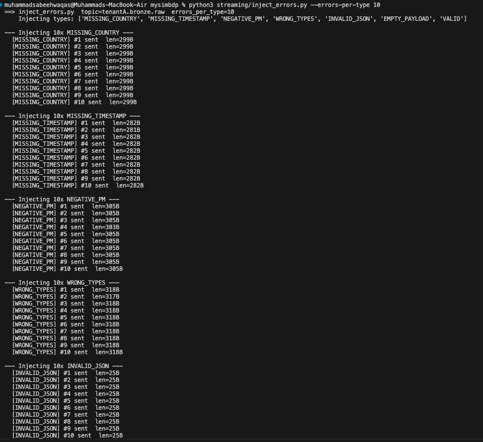
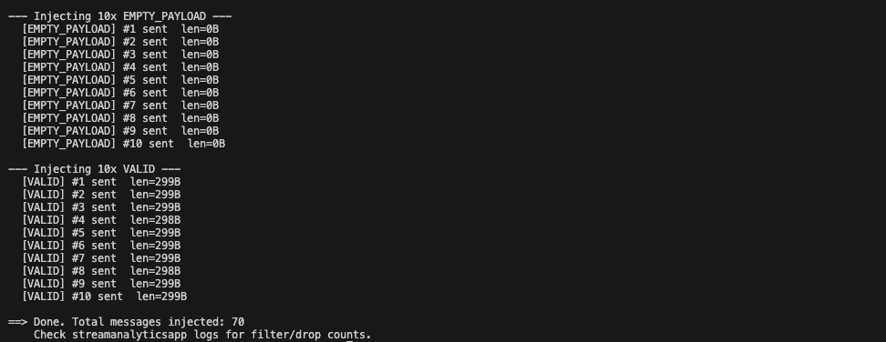

docker logs spark-streaming after injection, job still running, no crash
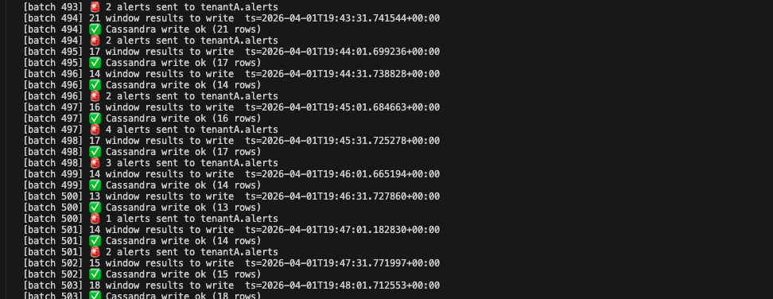

**How erroneous data is simulated:** I have created a dedicate python code `streaming/inject_errors.py` to inject errors by sending 7 types of bad records directly to `tenantA.bronze.raw` while the streaming job is running:

| Error type          | What it sends              | How Spark handles it                                                                      |
| ------------------- | -------------------------- | ----------------------------------------------------------------------------------------- |
| `MISSING_COUNTRY`   | `country: null`            | Dropped at step 3 (null check)                                                            |
| `MISSING_TIMESTAMP` | `timestamp: null`          | Dropped at step 3 (null check)                                                            |
| `NEGATIVE_PM`       | `pm2_5_P2: -999.0`         | Passes the filter - pulls down the window average (visible as an anomaly in Cassandra)    |
| `WRONG_TYPES`       | `pm2_5_P2: "not-a-number"` | `from_json` turns it into null for a DoubleType field - treated as missing in aggregation |
| `INVALID_JSON`      | `{ this is not json`       | `from_json` returns an all-null row - dropped by the null country check                   |
| `EMPTY_PAYLOAD`     | Empty bytes                | Same as invalid JSON                                                                      |
| `VALID`             | Normal record              | Processed as usual                                                                        |

**Test design:** 10 records of each error type were injected while the job was running. The job was watched for multiple consecutive batches after injection.

**Results:** The streaming job never crashed or stopped during error injection. Structurally bad records (null country, null timestamp, invalid JSON) were silently dropped and did not reach the aggregation step. The `record_count` in affected windows must be slightly lower than normal, reflecting the dropped records. The filter only removes records that are structurally broken (missing required fields), not ones that have physically impossible values. Adding a domain-level validation step (rejecting values below 0) would require an extra filter and is a known limitation of the current design.

---

### P2.5 - Parallelism

**What controls parallelism in this setup:**

- `--master local[2]` - the number of CPU threads Spark uses for task execution
- `SPARK_SHUFFLE_PARTITIONS` - how many partitions are created when Spark reshuffles data during the `groupBy` operation
- Kafka topic partitions (6) - this is the hard upper limit on how many Kafka partitions Spark can read in parallel
- Number of distinct countries in the data - determines how many groups exist per window; if only 3 countries appear in a batch, you cannot parallelise more than 3 groups no matter how many threads you have

**`[SS NEEDED: spark-streaming logs at local[2] during flood speed - showing batch durations]`**

```
[ADD: ]
```

**`[SS NEEDED: spark-streaming logs at local[4] during flood speed - showing faster batch durations]`**

```
[ADD: ]
```

**Test results:**

| Configuration           | Batch duration (flood speed) | Kafka lag after 60s   |
| ----------------------- | ---------------------------- | --------------------- |
| local[2], partitions=4  | `[ADD value]` ms             | `[ADD value]` records |
| local[4], partitions=8  | `[ADD value]` ms             | `[ADD value]` records |
| local[8], partitions=16 | `[ADD value]` ms             | `[ADD value]` records |

Increasing parallelism reduces batch duration, but only up to a point. Beyond local[4], the gains get smaller because the bottleneck shifts from CPU to Kafka fetch rate and Cassandra write speed. With a single-node Cassandra, throwing more parallel threads at it actually makes things worse - more threads compete for the same Cassandra coordinator, which increases write latency rather than reducing it.

---

## Part 3 - Extension

### P3.1 - Integrating an External ML Inference Service

The simplest way to plug in an external ML inference REST service is to call it from inside the `foreachBatch` function, after the window aggregation produces a batch of results.

Here is what the flow would look like:

1. The Spark streaming job runs as normal and produces a batch of window results (e.g., 20 rows - one per country per window)
2. Inside `write_batch()`, before writing to Cassandra, those 20 rows get serialized into a JSON list and sent in a single HTTP POST to the ML service endpoint
3. The ML service returns a prediction for each row - for example a pollution forecast for the next hour, or a flag saying whether the reading looks like a sensor malfunction
4. That prediction gets added as an extra column to the result and written to Cassandra alongside the original window data

What the tenant needs to do to use this:

1. Register the ML service URL as an environment variable in `docker-compose.yaml` (e.g., `ML_SERVICE_URL`)
2. Add an HTTP client call inside `write_batch()` using Python's `requests` library
3. Add retry and timeout logic - ML inference can be slow, and if the service is down the Spark job should not hang
4. Define the schema of what the ML service returns so it can be stored cleanly in Cassandra

The most important design choice is to send the whole batch in one HTTP request rather than one request per record. Sending 20 rows in one call is far faster than 20 separate calls - it reduces network overhead and lets the ML service process the batch efficiently.

---

### P3.2 - Storing Erroneous Records for Inspection

Right now, records that fail validation (null country, null timestamp, unparseable JSON) are silently dropped and lost forever. To save them for later inspection, the approach is to split the data stream into two branches before the null filter step:

```python
valid   = parsed.filter(col("country").isNotNull() & col("timestamp").isNotNull())
invalid = parsed.filter(col("country").isNull()    | col("timestamp").isNull())
```

The `invalid` branch gets written to a separate Cassandra table `tenanta_analytics.bad_records` with these columns:

- `ingest_ts` - when the bad record arrived
- `raw_value` - the original message bytes as a string so the full bad record is preserved
- `error_reason` - which check it failed (e.g., `MISSING_COUNTRY`, `INVALID_JSON`)
- `batch_id` - which Spark batch it came from

Both the valid write to `window_results` and the invalid write to `bad_records` happen inside the same `foreachBatch` call. This keeps them in sync - either both happen or neither does.

A data engineer can then query `bad_records` at any time to see what went wrong, fix the upstream producer if needed, or replay corrected records.

---

### P3.3 - Workflow Coordination for Batch Analytics Trigger

When the tenant's `alert_consumer.py` detects a critical condition (more than 10 alerts for the same country within 5 minutes), it should trigger a deeper historical analysis automatically. Apache Airflow handles this coordination.

Here is the full flow with a diagram:

```
[tenant-alert-consumer]
  receives alerts from tenantA.alerts
  keeps a rolling count per country
  IF count > 10 in last 5 minutes:
        |
        v
[Airflow REST API]
  POST /api/v1/dags/air_quality_batch_analytics/dagRuns
  payload: { country, triggered_at, alert_count, avg_pm25 }
        |
        v
[Airflow DAG - 3 tasks in sequence]
        |
        |--- Task 1: batch_analytics
        |    Reads tenanta_analytics.window_results from Cassandra
        |    for the last 24 hours for the triggered country
        |    Computes hourly averages, peak window, breach count
        |    Writes result to /tmp/batch_result_{country}.parquet
        |
        |--- Task 2: upload_results
        |    Reads the parquet file from Task 1
        |    Uploads to GCS: gs://bucket/batch_reports/{country}/{date}/
        |    Writes a small JSON metadata file alongside it
        |
        |--- Task 3: notify_tenant
             Reads the GCS path from Task 2
             Sends email (SendGrid) or Slack message to tenant user
             Contains: country, peak PM2.5, breach count, download link
```

Why use Airflow rather than just writing this in plain Python?

- If Task 1 fails, Airflow retries it automatically - Task 2 never runs with missing data
- If Task 2 fails, the analytics result from Task 1 is still saved - you can re-run Task 2 alone from the Airflow UI without redoing the analysis
- Every run is fully logged - when it started, how long each step took, what failed
- The `alert_consumer.py` just fires one HTTP POST and forgets - it does not need to know how GCS works or how to send email

---

### P3.4 - Schema Evolution

**How the running job handles a new schema:** The `INPUT_SCHEMA` in `streamanalyticsapp.py` is defined explicitly. When new data arrives with a different schema - for example a new field `temperature` is added, or `pm2_5_P2` gets renamed to `pm25` - PySpark's `from_json` handles it gracefully: unknown fields are ignored, and missing fields come through as null. The job will not crash. But it will silently miss the new field, which could be a problem if the new field is important.

**How the developer finds out about a schema change before it causes problems:**

Option 1 - Schema registry: Use Confluent Schema Registry (or a simple version table stored in Cassandra). The producer registers its current schema on startup. The streaming job reads the registered schema on startup and compares it with its own `INPUT_SCHEMA`. If they differ, the job refuses to start and logs a clear warning. A monitoring alert then notifies the developer.

Option 2 - Schema version field: Add a `schema_version` integer to every Kafka message. Inside `write_batch()`, the job checks this field. If it sees a version number it does not recognise, it routes those records to the `bad_records` table and publishes an alert to `tenantA.alerts` with `alert_reason = UNKNOWN_SCHEMA_VERSION`. The developer sees this in the monitoring dashboard and knows a new schema has been deployed upstream.

Both options give the developer a heads-up before bad data silently corrupts the analytics results.

---

### P3.5 - End-to-End Exactly-Once Delivery

**Short answer:** End-to-end exactly-once is not fully achievable with the current design, but it is very close, and the gap is small and well-understood.

**What the current design already gets right:**

1. **Producer to Kafka:** The producer uses `enable.idempotence=True` - so even if it retries a send, Kafka deduplicates it. No duplicate messages from the producer side.

2. **Kafka to Spark:** Spark reads with checkpointing enabled. If Spark restarts, it picks up from the last committed Kafka offset and does not skip or reprocess records at the Spark state level.

3. **Spark to Cassandra:** The Cassandra write is idempotent - writing the same `(country, window_start)` row twice just overwrites it with the same data. So even if a batch is retried, Cassandra ends up with the correct result.

**Where exactly-once breaks down:**

The problem is the dual write inside `foreachBatch` - writing to both Cassandra and Kafka in the same batch. These are two separate systems with no shared transaction. If the Cassandra write succeeds but the Kafka alert publish then fails (or the other way around), the two sinks end up inconsistent. A retry will fix Cassandra again but the alert may now be published twice.

**What would be needed for true exactly-once:**

- Use Kafka's transactional producer API (`transactional.id` + `isolation.level=read_committed`) for the alert publish
- This still does not cover the Cassandra side - Cassandra does not support distributed transactions with Kafka

In practice, the current design is close enough for a public health monitoring use case. A duplicate alert is much less harmful than a missed alert, and the Cassandra data is always correct because writes are idempotent. True end-to-end exactly-once across two different storage systems would require a two-phase commit or saga pattern, which adds significant complexity and latency for limited real-world benefit in this scenario.
